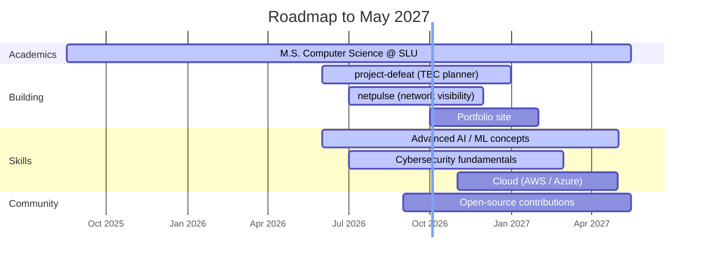

<div align="center">

# 👋 Hi, I'm Joseph Evenson

### Computer Science • Information Technology • Cool Hardware Personal Projects

<!-- Replace with your banner GIF -->

<br>

[](https://git.io/typing-svg)
<br>

[](https://git.io/typing-svg)
<br>

[](https://git.io/typing-svg)
<br>

</div>

---

# 🚀 About Me

```yaml
Name: Joseph Evenson

Education:
  - Missouri Southern State University (Bachelors) (Graduated May 2025, Information Technology)
  - Saint Louis University (Masters) (Expected Graduation May 2027, Computer Science)

Focus:
  - Hardware
  - Networking
  - Web Development

Languages:
  - Java
  - Python
  - C#
  - JavaScript
  - SQL

Fun Fact:
  I enjoy building projects that solve my real-world needs.
```

  

---

# ⚡ GitHub Metrics

<div align="center">


<br>

</div>

---

# 📅 Contribution Snake

<div align="center">

<picture>
  <source media="(prefers-color-scheme: dark)" srcset="https://raw.githubusercontent.com/josephevenson08/josephevenson08/output/github-contribution-grid-snake-dark.svg" />
  <source media="(prefers-color-scheme: light)" srcset="https://raw.githubusercontent.com/josephevenson08/josephevenson08/output/github-contribution-grid-snake.svg" />
  
</picture>

</div>

---

# 📌 Featured Projects

<div align="center">

<a href="https://github.com/josephevenson08/project-defeat"></a>
<a href="https://github.com/josephevenson08/Posd"></a>
<a href="https://github.com/josephevenson08/DoctorPortal-Backend"></a>
<a href="https://github.com/josephevenson08/TunezBot"></a>

</div>

<br>

| Project | What it is | Stack |
|:--|:--|:--|
| 🩺 **[Posd](https://github.com/josephevenson08/Posd)** | Full-stack doctor–patient records portal, shipped with a portable SQL dump so it runs anywhere. | `React` `Express` `TypeScript` `MySQL` |
| 🔒 **[DoctorPortal-Backend](https://github.com/josephevenson08/DoctorPortal-Backend)** | REST API with role-based auth, `scrypt` password hashing, session-protected routes, and an audit trail. | `TypeScript` `Drizzle ORM` `MySQL` |

<div align="center">

### WiP
**[TunezBot](https://github.com/josephevenson08/TunezBot)** | Discord music bot: slash commands, queue control, loop, YouTube search + playback. | `JavaScript` `discord.js`
<br>
**[project-defeat](https://github.com/josephevenson08/project-defeat)** | Local-first gear / talent / BiS planner for TBC WoW Classic Anniversary. All 9 classes, 27 specs, socket + enchant + crafting-recipe metadata. | `React` `TypeScript` `Vite` 
<br>
**[netpulse](https://github.com/josephevenson08/netpulse)** — at-home network visibility application &nbsp;·&nbsp; `Next.js` `TypeScript`
**<br>**


</div>

---

# 📈 Coding Activity

<div align="center">


</div>

<!-- OPTIONAL UPGRADE — real hours-per-language from your editor:
     1. Sign up at https://wakatime.com, install the plugin for VS Code / JetBrains / Visual Studio
     2. WakaTime profile settings -> check "Display coding activity publicly"
     3. Uncomment the block below and set your WakaTime username
<div align="center">

</div>
-->

---

# 🎯 Current Goals

<!-- The ```mermaid fence below is REQUIRED. Without it GitHub prints the
     chart as plain text. If you copy this file by hand, copy from the Raw
     view — rendered-page copy/paste strips code fences. -->



| | Goal | Status |
|:--:|:--|:--|
| 🔭 | Building portfolio-worthy projects |  |
| 🌱 | Learning advanced AI concepts |  |
| 🔐 | Improving cybersecurity skills |  |
| 🤝 | Contributing to open source |  |
| ☁️ | Learning cloud technologies |  |
| 🎓 | M.S. Computer Science |  |

---

<!-- 📷 GALLERY — commented out so it doesn't render two broken images.
     Paste real GIF URLs over the placeholders and delete these comment markers.

# 📷 Gallery

<div align="center">


</div>

---
-->

# 🌎 Connect With Me

<p align="center">

<a href="mailto:josephevenson37@gmail.com">

</a>

</p>

---

<div align="center">

<br><br>

### ⭐ Thanks for stopping by!


</div>
